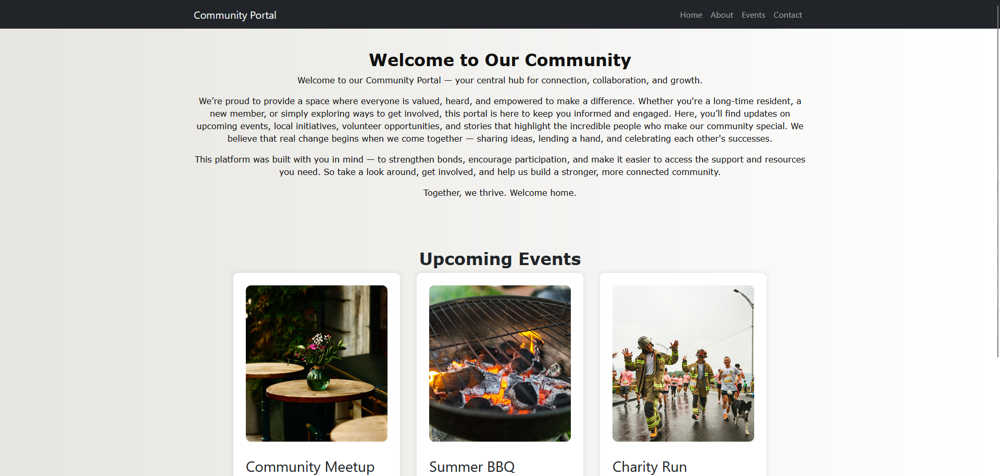
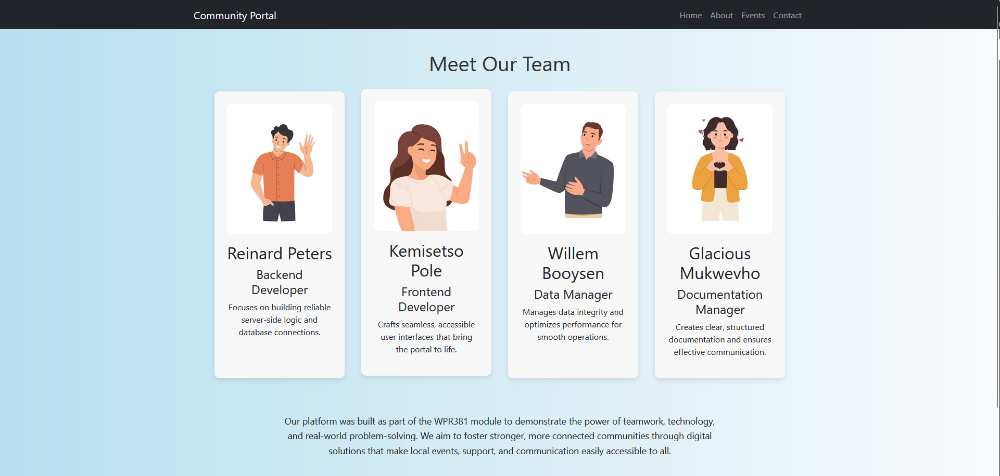
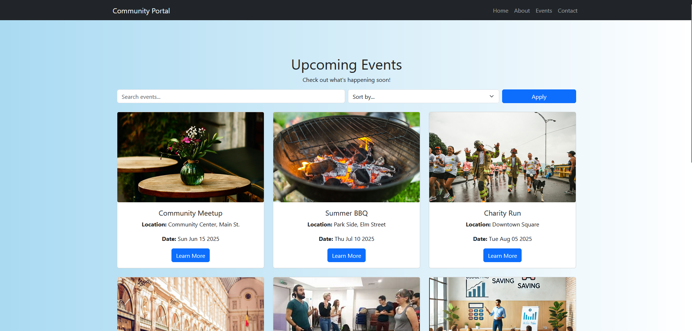
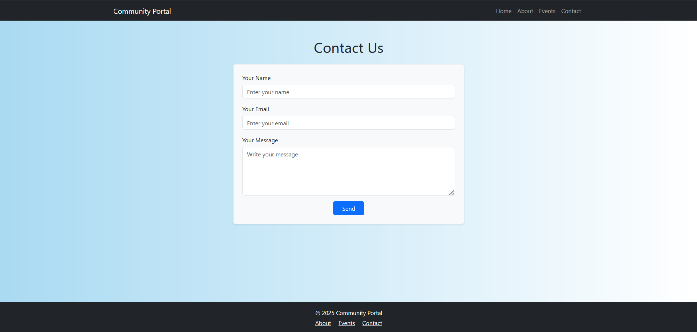
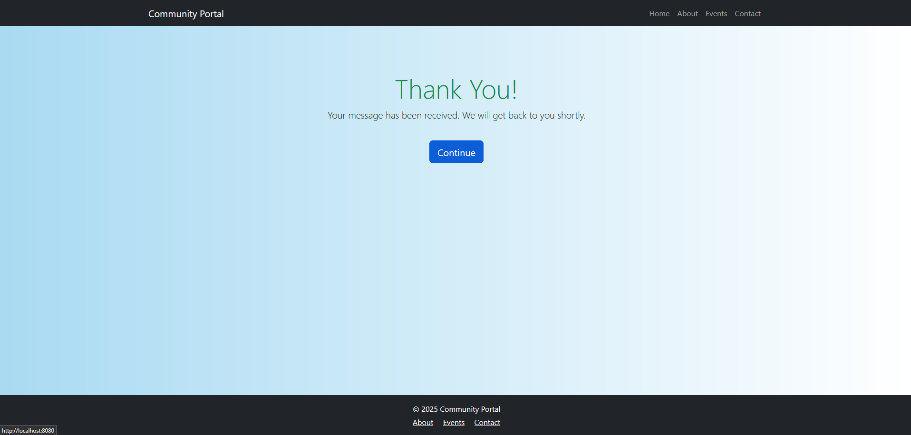

# 🌐 Community Portal Website

## 📋 Overview

The **Community Portal** is a dynamic Node.js web application designed to provide a centralized online space for community engagement. It features structured web pages for community information, events, and communication. Built using Express.js and EJS templating, the portal dynamically renders content and includes a functional contact form for user submissions.

## 🛠 Technologies Used

- **Node.js** (v18+)
- **Express.js** (v4+)
- **EJS** (v3+)
- **Nodemon** (for development)
- **CSS** and **Bootstrap 5** (optional for styling)
- **Git & GitHub** (for version control)

## 👥 Team Members and Roles

- **[Your Name]** – Team Lead  
- **[Reinard Pieters]** – Backend Developer  
- **[Kemisetso Pole]** – Frontend Developer  
- **[Willem Booysen]** – Data Manager  
- **[Glacious Mukwevho]** – Documentation Manager  

_All members contributed to both frontend and backend development._
## 🖼 Screenshots

### Home Page


### About Page


### Events Page


### Contact Form


### Thank You Confirmation


## 🚀 Setup Instructions

1. **Clone the repository:**
   ```bash
   git clone <https://github.com/ReinardPieters/WPR381_Project>
   cd community-portal